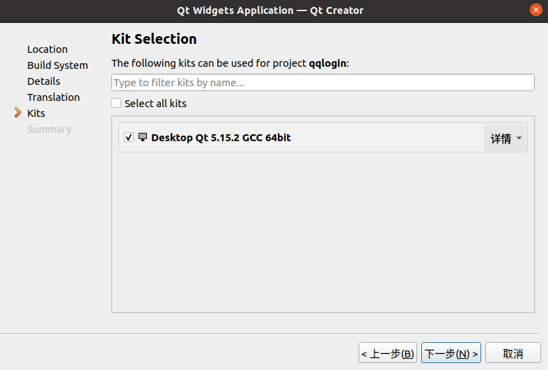
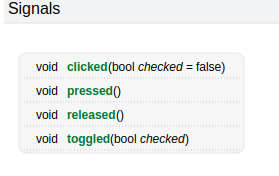

# 做一个简单的qt界面  
qt的移植性非常强。一套代码我们不用改太多，直接通用所有的平台。  
如何做一个简单的qt界面？  

1. 创建一个QT工程；步骤如下：  
     
   创建一个qt工程，所以选择Application(Qt),Qt Widgets Application,点击choose  
     
   设置文件名与存放路径，注意不要有中文路径！
     
   选择编译工具 qmake或者cmake。
   qmake是qt原生的，简单易懂，适合简单的qt程序，而cmake功能更强大，由于我之前用的就是cmake，所以更习惯用cmake。  
     
   基类选择QWidget，其他的不用动，点击下一步  
   
   选择文件翻译语言，依据所需选取，一般来说不需要。  
     
   选择编译器，默认就好。  
     
   项目管理，以后有需求可以添加git，点击完成。  
     
   项目文件，包括CMakeLists、源文件、头文件、ui文件；制作qt界面的话，双击widget.ui,进入ui编辑器。  
     
   ui编辑器面板介绍如图中所示。  
   做一个简单的QQ登录界面，用到的组件：  
   1. qlabel,放文本、图片、gif图等；  
      修改其属性：字体大小(font-点大小)、居中对齐(alignment-水平的-AlignHCenter)
   2. qlineedit,一行文本输入，不会换行，用于放账号和密码的对话框;  注意密码输入应该输入时明文，输入完成后密文，可以通过属性编辑器中的echoMode-PasswordEchoOnEdit设置；
   3. qpushbutton,按钮，用于做注册和登录的按钮；  
   效果如下：  
   输入账号和密码后：  
   给控件改名：为了分析代码方便，改的名字要通俗易懂；选中控件，在对象栏中双击对应的对象进行改名；
   此时的注册和登录按钮只是摆设，如需真正起作用要关联信号与槽。  
2. 什么是信号与槽？  
   信号：信号就是指控件发出的特定的信号。  
   比如按钮的信号：  
       
   槽：槽就是槽函数的意思，我们可以把槽函数绑定在某一个控件的信号上，类似于单片机中的中断回调函数。
3. 怎么关联信号与槽？  
   1. 自动关联：手动在ui界面选中控件，右键-转到槽。  
      自动关联会给我们的工程添加以下内容：  
      第一部分：槽函数声明
        
      槽函数只能声明到private slots或者public slots 下面。  
      第二部分：槽函数实现  
        
   2. 手动关联：使用connect这个函数。  
      ```cpp
      //模板
      connect(A,SIGNAL(B),C,SLOT(D));
      //当对象A发出B信号时，就会触发对象C的槽函数D；  
      //实例
      connect(ui->loginBt,SIGNAL(clicked()),this,SLOT(loginBt_clicked_slots()));
      ```  
       


